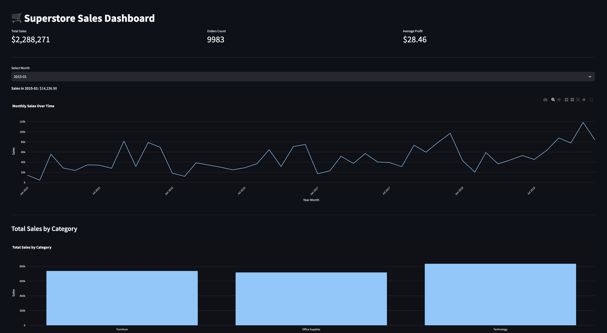
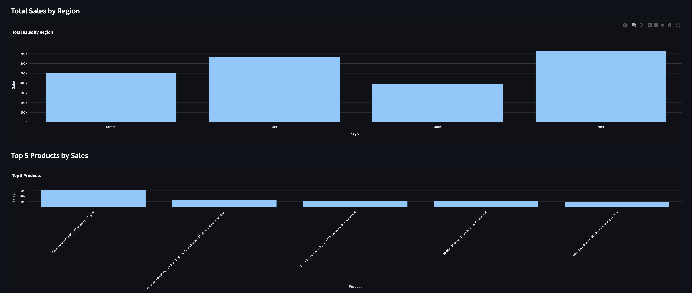
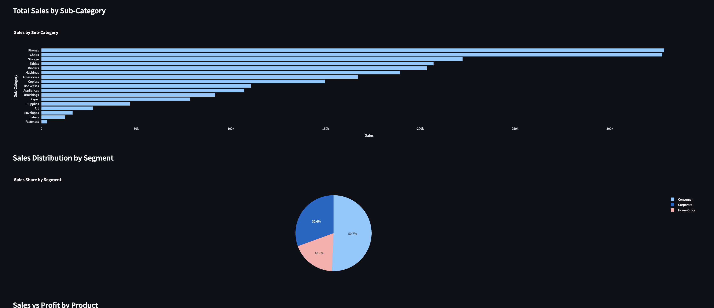
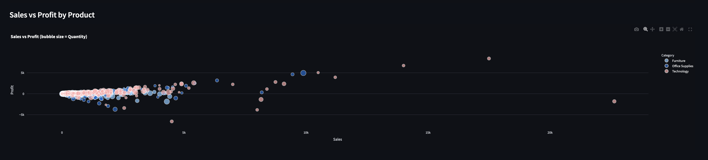

# 🚀 Superstore Sales EDA & Dashboard

**Objective:**  
Perform Exploratory Data Analysis on the Superstore dataset and build an interactive Streamlit dashboard.

## Contents
- `Superstore_EDA.ipynb` — Jupyter/Colab notebook with step-by-step EDA and insights  
- `dashboard.py`        — Streamlit app for interactive visualization  
- `requirements.txt`    — Python dependencies  
- `pic/1.png`–`pic/4.png` — Dashboard screenshots  

## How to Run
1. **Clone** the repo and navigate into it:  
   ```bash
   git clone https://github.com/<your-username>/superstore-sales-eda.git
   cd superstore-sales-eda
2. **Install** dependencies:
   ```bash
    pip install -r requirements.txt
3. **Run** the dashboard:
  ```bash
   streamlit run dashboard.py
        Then open http://localhost:8501 in your browser.
```
4. **Explore** the notebook:
  Open Superstore_EDA.ipynb in Jupyter or Colab for detailed EDA.


## Dashboard Screenshots






   
